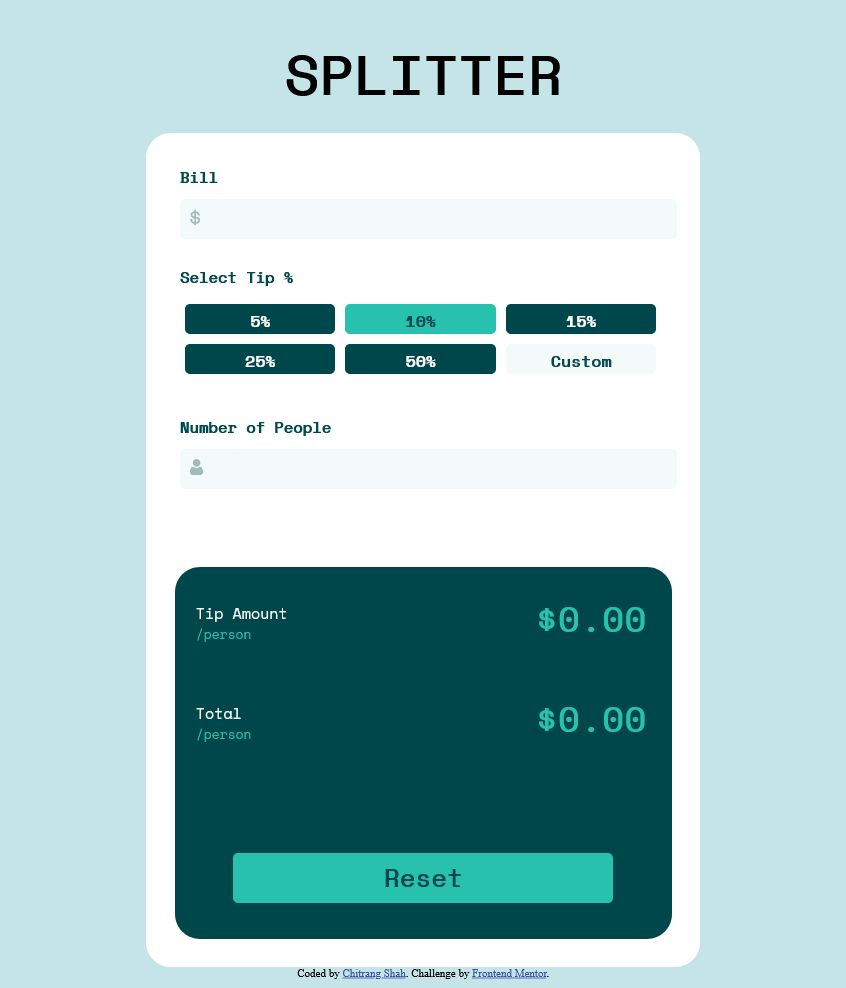
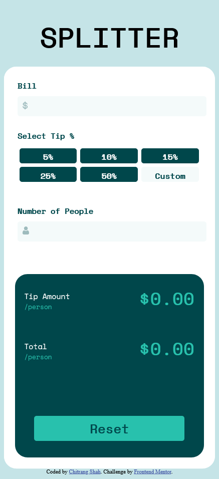

# Frontend Mentor - Tip calculator app solution

This is a solution to the [Tip calculator app challenge on Frontend Mentor](https://www.frontendmentor.io/challenges/tip-calculator-app-ugJNGbJUX). Frontend Mentor challenges help you improve your coding skills by building realistic projects.

## Table of contents

- [Overview](#overview)
  - [The challenge](#the-challenge)
  - [Screenshot](#screenshot)
  - [Links](#links)
- [My process](#my-process)
  - [Built with](#built-with)
  - [What I learned](#what-i-learned)
  - [Continued development](#continued-development)
- [Author](#author)

## Overview

A tip calculator application designed with responsive website using HTML, CSS and JavaScript.

### The challenge

Users should be able to:

- View the optimal layout for the app depending on their device's screen size
- See hover states for all interactive elements on the page
- Calculate the correct tip and total cost of the bill per person

### Screenshot

#### Tablet Screenshot

#### Mobile Screenshot

### Links

- Solution URL: [https://cwebdev.github.io/Tip-Calculator-App/](https://cwebdev.github.io/Tip-Calculator-App/)
- Live Site URL: [https://cwebdev.github.io/Tip-Calculator-App/](https://cwebdev.github.io/Tip-Calculator-App/)

## My process

### Built with

- Semantic HTML5 markup
- Flexbox
- Mobile-first workflow

### What I learned

- It is beneficial to create mobile first design and then move towards desktop design providing responsive styling using CSS media query.
- HTML input tag with number type allows '-' and 'e' signs by default. Disable them if not needed in project

### Continued development

Would want to work more on CSS flexbox and also explore more frameworks like Next.js.

## Author

- Website - [Chitrang Shah](https://chitrang.webflow.io/)
- Frontend Mentor Profile - [@cwebdev](https://www.frontendmentor.io/profile/cwebdev)